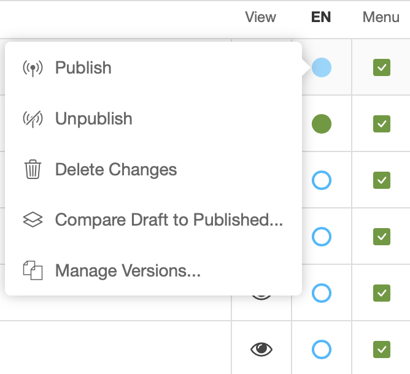

Integrating Versioning
======================

.. toctree::
   :maxdepth: 2
   :caption: Quick Start:

Let's say we have an existing `blog` application. To make the `blog` app work with versioning, you would need to take the following steps:

    1. Change the model structure.
    2. Register the `Post` model for versioning
    3. (optionally as needed) Implement a custom copy function
    4. (optionally as needed) Additional/advanced configuration

Change the model structure
----------------------------
Assuming that our `blog` app has one db table:

.. graphviz::

     digraph ERD1 {
      graph [   rankdir = "LR" ];
      ranksep=2;

      "Post" [ label="<Post> Post|<PK_GROUPER_ID>id \l |site \l title \l text \l " shape = "record" ];

      "Post":"PK_GROUPER_ID" [arrowhead = crow];
    }

This would have to change to a db structure like this:

.. graphviz::

     digraph ERD2 {
      graph [   rankdir = "LR" ];
      ranksep=2;

      "Post" [ label="<Post> Post|<PK_GROUPER_ID>id \l |site \l " shape = "record" ];
      "PostContent" [ label="<PostContent> PostContent|<PK_CONTENT_ID>id \l |<FK_POST>post \l |title \l text \l " shape = "record" ];

      "Post":"PK_GROUPER_ID"->"PostContent":"FK_POST" [arrowhead = crow];
    }

Or in python code, `models.py` would need to change from:

.. code-block:: python

    # blog/models.py
    from django.db import models
    from django.contrib.sites.models import Site

    class Post(models.Model):
        site = models.ForeignKey(Site, on_delete=models.CASCADE)
        title = models.CharField(max_length=100)
        text = models.TextField()

To:

.. code-block:: python

    # blog/models.py
    from django.db import models
    from django.contrib.sites.models import Site

    class Post(models.Model):
        site = models.ForeignKey(Site, on_delete=models.CASCADE)

    class PostContent(models.Model):
        post = models.ForeignKey(Post, on_delete=models.CASCADE)
        title = models.CharField(max_length=100)
        text = models.TextField()

`Post` becomes a :term:`grouper model <grouper model>` and `PostContent` becomes a :term:`content model <content model>`.

Keep in mind that it's not necessary to name the :term:`content model <content model>` `PostContent`,
it's just a naming convention. You could name the :term:`content model <content model>`
`Post` and have `PostGrouper` as the name of :term:`grouper model <grouper model>` or come up with completely different naming.

Once the integration with versioning is complete, versioning will treat `Post` as the object being versioned and `PostContent` as a place
to store data specific to each version. So every `Post` object will potentially have many `PostContent` objects
referring to it via the `post` foreign key field. The states of the `PostContent` versions (whether they're published, drafts etc.) are represented
in a separate model called `Version`, which has what is effectively a one2one relationship with `PostContent`.

Deciding which fields should be in the :term:`content model <content model>` and which in the :term:`grouper model <grouper model>`
depends on which data should be versioned and which should not. In this example we're assuming that which site a blog post appears on
cannot be changed, therefore we would not want to version it (it never changes so there's nothing to version!). But if your project
assumes that the site can be changed and those changes should be versioned, we would put that field in the `PostContent` model.

Register the model for versioning
----------------------------------

Now we need to make versioning aware of these models. So we have to register them in the `cms_config.py` file.
A very basic configuration would look like this:

.. code-block:: python

    # blog/cms_config.py
    from cms.app_base import CMSAppConfig
    from djangocms_versioning.datastructures import VersionableItem, default_copy
    from .models import PostContent

     class BlogCMSConfig(CMSAppConfig):
        djangocms_versioning_enabled = True
        versioning = [
            VersionableItem(
                content_model=PostContent,
                grouper_field_name='post',
                copy_function=default_copy,
            ),
        ]

In this configuration we must specify the :term:`content model <content model>` (`PostContent`),
the name of the field that is a foreign key to the :term:`grouper model <grouper model>` (`post`)
and a :term:`copy function <copy function>`. For simple model structures, the `default_copy` function
which we have used is sufficient, but in many cases you might need to write your own custom :term:`copy function <copy function>`
(more on that below).

Once a model is registered for versioning its behaviour changes:

1. It's default manager (``Model.objects``) only sees published versions of the model. See :term:``content model``.
2. It's ``Model.objects.create`` method now will not only create the :term:`content model` but also a corresponding ``Version`` model. Since the ``Version`` model requires a ``User`` object to track who created which version the correct way of creating a versioned :term:`content model` is::

    Model.objects.with_user(request.user).create(...)

  In certain situations, e.g., when implementing a :term:`copy function`, this is not desirable. Use ``Model._original_manager.create(...)`` in such situations.

.. note::

    If you want to allow using your models with and without versioning enabled we suggest to add dummy manager to your model that will swallow the ``with_user()`` syntax. This way you can always create objects with::

        class ModelManager(models.Manager):
            def with_user(self, user):
                return self

        class MyModel(models.Model):
            objects = ModelManager()

            ...

For more details on how `cms_config.py` integration works please check the documentation
for django-cms>=4.0.

Accessing content model objects
-------------------------------

Versioned content model objects have a customized ``objects`` manager which by
default only creates querysets that return published versions of the content
object. This will ensure that only published objects are visible to the public.

In some situations, namely when working in the admin, it is helpful to also have
other content objects available, e.g. when linking to a not-yet-published object.

Versioned objects therefore also have an additional manager ``admin_manager``
which can access all objects. To get all draft blog posts, you can write
``PostContent.admin_manager.filter(versions__state=DRAFT)``. Since the
``admin_manager`` has access to non-public information it should only be
used inside the Django admin (hence its name).

Implement a custom copy function
---------------------------------
Whilst simple model structures should be fine using the `default_copy` function,
you will most likely need to implement a custom copy function if your :term:`content model <content model>`
does any of the following:

    - Contains any one2one or m2m fields.
    - Contains a generic foreign key.
    - Contains a foreign key that relates to an
      object that should be considered part of the version. For example
      if you're versioning a poll object, you might consider the answers
      in the poll as part of a version. If so, you will need to copy
      the answer objects, not just the poll object. On the other hand if
      a poll has an fk to a category model, you probably wouldn't consider
      category as part of the version. In this case the default copy function
      will take care of this.
    - Other models have reverse relationships to your content model and
      should be considered part of the version

So let's get back to our example and complicate the model structure a little. Let's say our
`blog` app supports the use of polls in posts and also our posts can be categorized.
Now our `blog/models.py` now looks like this:

.. code-block:: python

    # blog/models.py
    from django.db import models
    from django.contrib.sites.models import Site

    class Category(models.Model):
        name = models.CharField(max_length=100)

    class Post(models.Model):
        site = models.ForeignKey(Site, on_delete=models.CASCADE)

    class PostContent(models.Model):
        post = models.ForeignKey(Post, on_delete=models.CASCADE)
        title = models.CharField(max_length=100)
        text = models.TextField()
        category = models.ForeignKey(Category, on_delete=models.CASCADE)

    class Poll(models.Model):
        post_content = models.ForeignKey(PostContent, on_delete=models.CASCADE)
        name = models.CharField(max_length=100)

    class Answer(models.Model):
        poll = models.ForeignKey(Poll, on_delete=models.CASCADE)
        text = models.CharField(max_length=100)

If we were using the `default_copy` function on this model structure, versioning wouldn't necessarily do what you expect.
Let's take a scenario like this:

    1. A Post object has 2 versions - `version #1` which is archived and `version #2` which is published.
    2. We revert to `version #1` which creates a draft `version #3`.
    3. The PostContent data in `version #3` is a copy of what was in `version #1` (the version we reverted to), but the Poll and Answer data is what was there at the time of `version #2` (the latest version).
    4. We edit both the PostContent, Poll and Answer data on `version #3`.
    5. The PostContent data is now different in all three versions. However, the poll data is the same in all three versions. This means that the data edit we did on `version #3` (a draft) to Poll and Answer objects is now being displayed on the published site (`version #2` is published).

This is probably not how one would want things to work in this scenario, so to fix it, we need to implement a custom :term:`copy function <copy function>` like so:

.. code-block:: python

    # blog/cms_config.py
    from cms.app_base import CMSAppConfig
    from djangocms_versioning.datastructures import VersionableItem
    from .models import PostContent, Poll, Answer

    def custom_copy(original_content):
        content_fields = {
            field.name: getattr(original_content, field.name)
            for field in PostContent._meta.fields
            # don't copy pk because we're creating a new obj
            if PostContent._meta.pk.name != field.name
        }
        new_content = PostContent._original_manager.create(**content_fields)
        original_polls = Poll.objects.filter(post_content=original_content)
        for poll in original_polls:
            poll_fields = {
                field.name: getattr(poll, field.name)
                for field in Poll._meta.fields
                # don't copy pk because we're creating a new obj
                # don't copy post_content fk because we're assigning
                # the new PostContent object to it
                if field.name not in [Poll._meta.pk.name, 'post_content']
            }
            new_poll = Poll.objects.create(post_content=new_content, **poll_fields)
            for answer in poll.answer_set.all():
                answer_fields = {
                    field.name: getattr(answer, field.name)
                    for field in Answer._meta.fields
                    # don't copy pk because we're creating a new obj
                    # don't copy poll fk because we're assigning
                    # the new Poll object to it
                    if field.name not in [Answer._meta.pk.name, 'poll']
                }
                Answer.objects.create(poll=new_poll, **answer_fields)
        return new_content

     class BlogCMSConfig(CMSAppConfig):
        djangocms_versioning_enabled = True
        versioning = [
            VersionableItem(
                content_model=PostContent,
                grouper_field_name='post',
                copy_function=custom_copy,
            ),
        ]

As you can see from the example above the :term:`copy function <copy function>` takes one param (the content object of the version we're copying)
and returns the copied content object. We have customized it to create not just a new PostContent object (which `default_copy` would have done),
but also new Poll and Answer objects.

.. note::

    A custom copy method will need to use the content model's ``PostContent._original_manager`` to create only a content model object and not also a Version object which the ``PostContent.objects`` manager would have done!

Notice that we have not created new Category objects in this example. This is because the default behaviour actually suits Category objects fine.
If the name of a category changed, we would not want to revert the whole site to use the old name of the category when reverting a PostContent object.

Adding Versioning Entries to a Content Model Admin
--------------------------------------------------
Versioning provides a number of actions and fields through the :term:`ExtendedVersionAdminMixin`, these function by extending the :term:`ModelAdmin` :term:`list_display`
to add the fields:

* author

* modified date

* versioning state

* preview action

* edit action

* version list action

.. code-block:: python

    class PostContentAdmin(ExtendedVersionAdminMixin, admin.ModelAdmin):
        list_display = "title"

The :term:`ExtendedVersionAdminMixin` also has functionality to alter fields from other apps. By adding the :term:`admin_field_modifiers` to a given apps :term:`cms_config`,
in the form of a dictionary of {model_name: {field: method}}, the admin for the model, will alter the field, using the method provided.

.. code-block:: python

    # cms_config.py
    def post_modifier(obj, field):
        return obj.get(field) + " extra field text!"

    class PostCMSConfig(CMSAppConfig):
        # Other versioning configurations...
        admin_field_modifiers = [
            {PostContent: {"title": post_modifier}},
        ]

Given the code sample above, "This is how we add" would be displayed as
"this is how we add extra field text!" in the changelist of PostAdmin.

Adding status indicators to a versioned content model
-----------------------------------------------------

djangocms-versioning provides status indicators for django CMS' content models, you may know them from the page tree in django-cms:

You can use these on your content model's changelist view admin by adding the following fixin to the model's Admin class:

.. code-block:: python

    import json
    from djangocms_versioning.admin import StateIndicatorMixin

    class MyContentModelAdmin(StateIndicatorMixin, admin.ModelAdmin):
        # Adds "indicator" to the list_items
         list_items = [..., "state_indicator", ...]

.. note::

    For grouper models the mixin expects that the admin instances has properties defined for each extra grouping field, e.g., ``self.language`` if language is an extra grouping field. If you derive your admin class from :class:`~cms.admin.utils.GrouperModelAdmin`, this behaviour is automatically observed.

    Otherwise, this is typically set in the ``get_changelist_instance`` method, e.g., by getting the language from the request. The page tree, for example, keeps its extra grouping field (language) as a get parameter to avoid mixing language of the user interface and language that is changed.

    .. code-block:: python

        def get_changelist_instance(self, request):
            """Set language property and remove language from changelist_filter_params"""
            if request.method == "GET":
                request.GET = request.GET.copy()
                for field in versionables.for_grouper(self.model).extra_grouping_fields:
                    value = request.GET.pop(field, [None])[0]
                    # Validation is recommended: Add clean_language etc. to your Admin class!
                    if hasattr(self, f"clean_{field}"):
                        value = getattr(self, f"clean_{field}")(value):
                    setattr(self, field) = value
                # Grouping field-specific cache needs to be cleared when they are changed
                self._content_cache = {}
            instance = super().get_changelist_instance(request)
            # Remove grouping fields from filters
            if request.method == "GET":
                for field in versionables.for_grouper(self.model).extra_grouping_fields:
                    if field in instance.params:
                        del instance.params[field]
            return instance

Adding Status Indicators *and* Versioning Entries to a versioned content model
------------------------------------------------------------------------------

Both mixins can be easily combined. If you want both, state indicators and the additional author, modified date, preview action, and edit action, you can simpliy use the ``ExtendedIndicatorVersionAdminMixin``:

.. code-block:: python

    class MyContentModelAdmin(ExtendedIndicatorVersionAdminMixin, admin.ModelAdmin):
        ...

The versioning state and version list action are replaced by the status indicator and its context menu, respectively.

Add additional actions by overwriting the ``self.get_list_actions()`` method and calling ``super()``.

Adding Versioning Entries to a Grouper Model Admin
--------------------------------------------------

Django CMS 4.1 and above provide the :class:`~cms.admin.utils.GrouperModelAdmin` as to creat model admins for grouper models. To add version admin fields, use the :class:`~djangocms_versioning.admin.ExtendedGrouperVersionAdminMixin`:

.. code-block:: python

    class PostAdmin(ExtendedGrouperVersionAdminMixin, GrouperModelAdmin):
        list_display = ["title", "get_author", "get_modified_date", "get_versioning_state"]

:class:`~djangocms_versioning.admin.ExtendedGrouperVersionAdminMixin` also observes the :term:`admin_field_modifiers`.

.. note::

    Compared to the :term:`ExtendedVersionAdminMixin`, the :term:`ExtendedGrouperVersionAdminMixin` does not automatically add the new fields to the :attr:`list_display`.

    The difference has compatibility reasons.

To also add state indicators, just add the :class:`~djangocms_versioning.admin.StateIndicatorMixin`:

.. code-block:: python

    class PostAdmin(ExtendedGrouperVersionAdminMixin, StateIndicatorMixin, GrouperModelAdmin):
        list_display = ["title", "get_author", "get_modified_date", "state_indicator"]

Summary admin options
---------------------

.. list-table:: Overview on versioning admin options: Grouper models
   :widths: 25 75
   :header-rows: 1

   * - Versioning state
     - Grouper Model Admin
   * - Text, no interaction
     - .. code-block::

            class GrouperAdmin(
                ExtendedGrouperVersionAdminMixin,
                GrouperModelAdmin
            )
                list_display = ...

   * - Indicators, drop down menu
     - .. code-block::

            class GrouperAdmin(
                ExtendedGrouperVersionAdminMixin,
                StateIndicatorMixin,
                GrouperModelAdmin
            )
                list_display = ...

.. list-table:: Overview on versioning admin options: Content models
   :widths: 25 75
   :header-rows: 1

   * - Versioning state
     - **Content Model Admin**
   * - Text, no interaction
     - .. code-block::

            class ContentAdmin(
                ExtendedVersionAdminMixin,
                admin.ModelAdmin
            )

   * - Indicators, drop down menu
     - .. code-block::

            class ContentAdmin(
                ExtendedIndicatorVersionAdminMixin,
                admin.ModelAdmin,
            )

Additional/advanced configuration
----------------------------------

The above should be enough configuration for most cases, but versioning has a lot more configuration options. See the :doc:`advanced_configuration` page for details.
